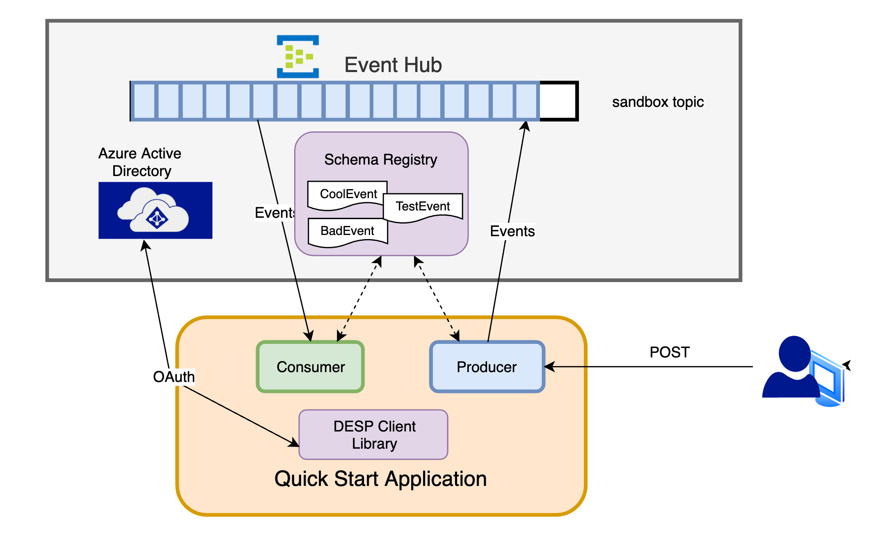

# Reference Solution for DESP in Azure Event Hub 
This project represents a reference solution for setting up a producer and consumer in Azure using Event Hub.  
It's based on spring boot and spring kafka.  It works by sending an event to the configured topic
then immediately reads it on the consumer side.  You may clone this repo
and run to quickly get your feet wet with DESP.



## UPDATE
Event Hubs namespaces can not be accessed within the Kroger Netowrk.
You no longer need to be off VPN to perform local development!


## General Features
* Security Configuration includes SASL/SSL
* Authentication using OAuth Tokens or SAS (Shared Access Signatures)
* Works with Avro messages / utilizes schema registry
* Simplified Configuration via the DESP Client Library

## Producer Features
* Demonstrates the Kafka API via Spring's KafkaTemplate
* Event Creation via Builder pattern on specific records
* Produces multiple event types
* Simple Retry Logic

## Consumer Features
* Demonstrates how to consume a specific record
* Demonstrates how to deal with various types serialization exceptions, and detect the root cause
* Demonstrates Consuming multiple event types on single topic
* (NEW!) Demonstrates Robust Retry Logic, Details see [this page](src/main/java/com/kroger/desp/consumer/retry/README.md)

Disclaimer:  The intent of this project is to have get developers up and running
very quickly with an experimental project.   

## Quick Start Guide
Follow these steps to get your application running in minutes.

### 1) Whitelist your local IP address
In order to communicate with the schema registry in Azure, you
must whitelist your IP address.  This is done via a special
project: https://github.com/krogertechnology/desp-sr-clients.  Please
follow the instructions in the README.

### 2) Clone the repository
Clone the quick start project into your private work area.

```shell script

> git clone https://github.com/krogertechnology/desp-quickstart-eventhub

```

### 3) Edit runEventHub_oAuth.sh with credentials
Please see the DESP team for the credentials, and set them in the runEventHub_oAuth.sh launch script
```shell script
#
#  Please see DESP Team for credentials
#
export OAUTH_CLIENT_ID="..."
export OAUTH_CLIENT_KEY="..."
export OAUTH_TENANT_ID="..."
export SCHEMA_REGISTRY_SECRET="..."
#
#
```

### 4) Launch the application

```shell script
> runEventHub_oAuth.sh
Mon May 11 19:57:09 EDT 2020
[INFO] Scanning for projects...
[INFO] 
[INFO] ---------< com.kroger.desp:desp-producer-consumer-quick-start >---------
[INFO] Building desp-producer-consumer-quick-start 1.0.0
[INFO] --------------------------------[ jar ]---------------------------------
[INFO] 
[INFO] --- maven-clean-plugin:3.1.0:clean (default-clean) @ desp-producer-consumer-quick-start ---
[INFO] Deleting /Users/kon4929/Projects/desp-quickstart-eventhub/target
[INFO] 
[INFO] --- maven-resources-plugin:3.1.0:resources (default-resources) @ desp-producer-consumer-quick-start ---
[INFO] Using 'UTF-8' encoding to copy filtered resources.
[INFO] Copying 1 resource
[INFO] Copying 1 resource
[INFO] 
[INFO] --- maven-compiler-plugin:3.8.1:compile (default-compile) @ desp-producer-consumer-quick-start ---
[INFO] Changes detected - recompiling the module!
[INFO] Compiling 16 source files to /Users/kon4929/Projects/desp-quickstart-eventhub/target/classes
[INFO] /Users/kon4929/Projects/desp-quickstart-eventhub/src/main/java/com/kroger/desp/consumer/EventDispatcher.java: /Users/kon4929/Projects/desp-quickstart-eventhub/src/main/java/com/kroger/desp/consumer/EventDispatcher.java uses unchecked or unsafe operations.
[INFO] /Users/kon4929/Projects/desp-quickstart-eventhub/src/main/java/com/kroger/desp/consumer/EventDispatcher.java: Recompile with -Xlint:unchecked for details.
[INFO] 
[INFO] --- maven-resources-plugin:3.1.0:testResources (default-testResources) @ desp-producer-consumer-quick-start ---
[INFO] Using 'UTF-8' encoding to copy filtered resources.
[INFO] skip non existing resourceDirectory /Users/kon4929/Projects/desp-quickstart-eventhub/src/test/resources
[INFO] 
[INFO] --- maven-compiler-plugin:3.8.1:testCompile (default-testCompile) @ desp-producer-consumer-quick-start ---
[INFO] No sources to compile
[INFO] 
[INFO] --- maven-surefire-plugin:2.22.2:test (default-test) @ desp-producer-consumer-quick-start ---
[INFO] No tests to run.
[INFO] 

...
```

### Publish Test Events
The quick starter exposes a POST endpoint which, when invoked, will publish random events
to the sandbox topic.  Simply call the publish.sh script with the number of events.

In a different terminal, the following commend will publish 5 events.
```shell script
> ./publish.sh 10
```

### Viewing the output 
```shell script
2020-05-08 06:36:57.888  INFO 45241 --- [nio-8080-exec-1] com.kroger.desp.producer.KafkaProducer   : Sending EVENT #1 To topic: sandbox-dev
2020-05-08 06:36:58.755  INFO 45241 --- [ad | producer-1] com.kroger.desp.producer.KafkaProducer   : SUCCESS
2020-05-08 06:36:59.045  INFO 45241 --- [ntainer#0-0-C-1] com.kroger.desp.consumer.KafkaConsumer   : Consumed from partition 13, record type is: 18
2020-05-08 06:36:59.047  INFO 45241 --- [ntainer#0-0-C-1] com.kroger.desp.consumer.KafkaConsumer   : Handling Test Event  # {"sampleString": "Leilani Reynolds", "sampleStringOptional": "com.github.javafaker.Address@2d9e4e36", "sampleInt": 6, "sampleBoolean": true, "sampleFloat": 3.847, "sampleDouble": 3.4561, "sampleLong": 139272472, "sampleList": ["Nikko", "Santiago", "Wilhelm"], "sampleMap": {"Dulce1": "Abbott", "Cydney0": "Padberg"}, "eventHeader": {"id": "9b42fcd8-3518-4e29-9c88-48c0256199c2", "time": 1588934218236, "type": "com.kroger.desp.events.despelmr.test.TestEvent", "source": "my-event-producer"}}

```

### Coming soon...

1. Terraform for local event hub
2. DESP Schema registry endpoints
3. App Services sample devops pipeline
4. Application Insights Integration

